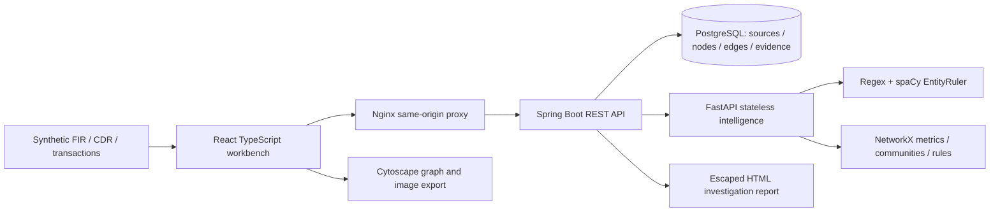

# NEXUS pitch notes

**Network Exploration & eXtraction for Unified Intelligence Systems**
“Three apparently unrelated cases are shown to be connected — with evidence
explaining exactly why.”

## Real versus mocked (slide-ready)
| Component | Status |
|---|---|
| FIR/CDR/transactions and all people | Seeded, entirely synthetic fixtures |
| Ingestion, validation, deduplication | Real running Spring Boot pipeline |
| Extraction | Real regex validators + spaCy EntityRuler; no downloaded NER model |
| Resolution | Real conservative deterministic keys + reversible human review |
| PostgreSQL evidence graph | Real persisted relational graph with JSONB |
| Graph analysis and R1–R6 | Real NetworkX computations, seeded and repeatable |
| Graph UI, search, filters, paths | Real Cytoscape workbench |
| Quality numbers | Measured on 18 synthetic template FIRs, not real-world accuracy |
| Report | Real printable HTML with optional graph PNG; browser PDF fallback |
| CCTNS/NCRP/bank/telecom integration | Not implemented; roadmap only |
| Login/roles | Not implemented; local synthetic prototype |

## Architecture

## Likely judge questions
**Is it real data?** No. Everything is synthetic and labeled. Production ingestion
would require formal data-sharing agreements, access controls and governance.

**How accurate is extraction?** On 18 independently labeled synthetic template FIRs:
27 exact type-and-span true positives, zero false positives or misses, so 100%
precision/recall on that tiny fixture set. This is a pipeline regression benchmark,
not a claim about diverse real FIRs. Structured records bypass NLP.

**Why not Maltego or i2 Analyst's Notebook?** The hackathon workflow combines source
ingestion, extraction, cross-case resolution, explainable rules and evidence-backed
exploration in one small local prototype. This is not a validated comparative study
or a claim those products lack comparable capabilities.

**False positives?** Public/service identifiers are visibly suppressed for R1/R2.
Same-name people with conflicting identifiers stay separate. Suggestions require
human review, merges can be undone, and every rule cites source evidence.

**Predicting crime?** No. This describes existing data. An investigator interprets
leads; the system never determines guilt or initiates enforcement.

**Influence means what?** Connectivity: 45% degree, 35% normalized betweenness,
20% normalized case count. The inspector shows the components. It is not culpability.

**Scale?** This demo has 146 nodes. Stateless analysis can be replaced independently;
larger graphs would need asynchronous jobs, limits and possibly Neo4j. No unmeasured
million-node performance claims.

**Internet outage?** No external APIs or fonts are used at runtime. Build dependencies
ahead of time. Take the local recording, screenshots, and exported HTML report too.

**Production ready?** No authentication/SSO, multi-tenant controls or formal audit.
It is bound to localhost with synthetic fixtures. See SECURITY.md for the roadmap.
