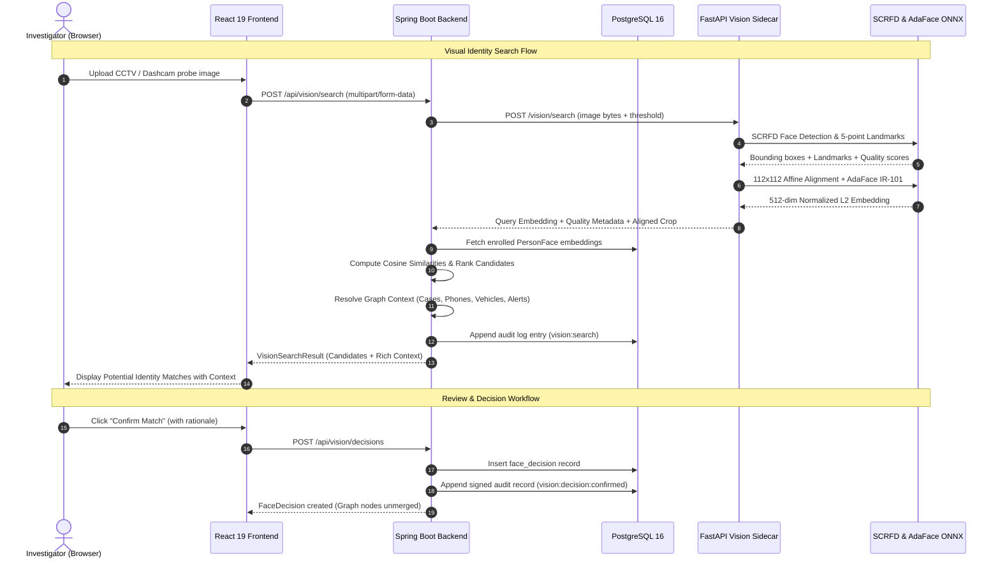

# NEXUS Visual Identity Search

## 1. Feature Overview

The **Visual Identity Search** subsystem provides candidate facial recognition capabilities for criminal-network investigations in NEXUS. It allows investigators to take unconstrained, low-quality surveillance imagery—such as CCTV snapshots, dashcam stills, ATM cameras, or witness mobile captures—and search against enrolled identities in the NEXUS database.

Crucially, NEXUS implements this capability strictly as an **investigative candidate-matching system**:
- Face recognition proposes prioritized leads ranked by cosine similarity.
- It **never** automatically creates, mutates, or merges canonical `Person` entities.
- Every match confirmation or rejection requires an explicit, authenticated decision by a human investigator, recorded with cryptographic provenance into an append-only, tamper-evident audit log.

---

## 2. Architecture & System Flow



---

## 3. Pretrained Model Selection

### Model Family & Identifiers

| Component | Architecture / Model | Identifier / Source | Weights Size |
|---|---|---|---|
| **Face Detector** | SCRFD-10G (KPS) | InsightFace / DeepInsight SCRFD-10G-KPS | ~16.9 MB |
| **Face Recognizer** | AdaFace IR-101 | `minchul/cvlface_adaface_ir101_webface12m` (ONNX export) | ~248.6 MB |

### Why AdaFace was Chosen

Standard face recognition loss functions (ArcFace, CosFace) assume uniform high-quality mugshot portraits. When applied to degraded, low-resolution surveillance footage, features from low-quality images are pushed to the same rigid angular margin, leading to high false-match rates on compression artifacts or noise.

**AdaFace (Adaptive Margin Face Recognition)** dynamically scales the angular margin based on feature norm, which acts as a proxy for image quality:
- For **high-quality images**, it enforces a standard large angular margin for discrimination.
- For **low-quality / blurry images**, it relieves the margin constraint, preventing gradient corruption from uninformative pixels.
- On low-resolution and surveillance benchmarks (such as IJB-S, QMUL-SurvFace, and TinyFace), AdaFace significantly outperforms conventional ArcFace and CosFace baselines.

### Why SCRFD was Chosen

- **Sample and Computation Redistribution (SCRFD)** is specifically optimized for efficient multi-scale face detection on CPU.
- It detects tiny faces down to $16 \times 16$ pixels in high-resolution frames with low computational overhead.
- It outputs 5 canonical facial keypoints (left eye, right eye, nose tip, left mouth corner, right mouth corner) essential for 2D similarity alignment.

---

## 4. Confirmation of No Model Training

> [!IMPORTANT]
> **NO model training was performed.**
> All inference relies strictly on frozen, pretrained weights published by the original academic researchers (`cvlface` / `AdaFace` IR-101 pretrained on WebFace12M, and `SCRFD-10G` pretrained on WiderFace).
> Inference runs locally on CPU via ONNX Runtime without fine-tuning, training, or external SaaS calls.

---

## 5. API Documentation

### 5.1 Enrolling a Reference Face

```http
POST /api/persons/{personId}/faces
Content-Type: multipart/form-data

file: <binary image>
```

- **Authorization:** `INVESTIGATOR` or `ADMIN` (`VIEWER` returns `403 Forbidden`).
- **Validation:** Image must contain exactly 1 usable human face; image size $\le 10\text{ MiB}$.
- **Response:** `200 OK`
```json
{
  "id": "face-a1b2c3d4e5f6",
  "personNodeId": "person_aariv",
  "imageHash": "9f86d081884c7d659a2feaa0c55ad015a3bf4f1b2b0b822cd15d6c15b0f00a08",
  "modelName": "adaface_ir101_webface12m",
  "modelVersion": "1.0.0",
  "createdAt": "2026-09-24T05:00:00Z",
  "qualityScore": 0.94,
  "metadata": {
    "filename": "aariv_ref.jpg",
    "thumbnail": "data:image/jpeg;base64,...",
    "personLabel": "Aariv Veylan"
  }
}
```

### 5.2 Visual Identity Search

```http
POST /api/vision/search
Content-Type: multipart/form-data

file: <probe image>
threshold: 0.60 (optional, default 0.65)
faceIndex: 0 (optional, for multi-face scenes)
```

- **Authorization:** `INVESTIGATOR`, `ADMIN`, or `VIEWER` (read-only query).
- **Response:** `200 OK`
```json
{
  "status": "MATCH_CANDIDATE",
  "facesDetected": 1,
  "threshold": 0.60,
  "model": "adaface_ir101_webface12m",
  "imageHash": "e3b0c44298fc1c149afbf4c8996fb92427ae41e4649b934ca495991b7852b855",
  "alignedThumbnail": "data:image/jpeg;base64,...",
  "faces": [
    {
      "faceIndex": 0,
      "score": 0.88,
      "thumbnail": "data:image/jpeg;base64,..."
    }
  ],
  "matches": [
    {
      "personNodeId": "person_aariv",
      "similarity": 0.742,
      "status": "CANDIDATE",
      "model": "adaface_ir101_webface12m",
      "faceId": "face-a1b2c3d4e5f6",
      "person": {
        "id": "person_aariv",
        "canonicalId": "person_aariv",
        "label": "Aariv Veylan",
        "type": "Person",
        "referencePhoto": "data:image/jpeg;base64,...",
        "cases": ["NXS-001", "NXS-002"],
        "phones": ["SYN-PHONE-001"],
        "accounts": ["SYN-ACCOUNT-001"],
        "vehicles": ["ZZ00NX0001"],
        "locations": ["Navapur Sector 1"],
        "activeAlertsCount": 1,
        "associates": [
          { "id": "person_mira", "label": "Mira Solven", "relation": "CO_ACCUSED" }
        ]
      }
    }
  ]
}
```

### 5.3 Recording an Investigator Decision

```http
POST /api/vision/decisions
Content-Type: application/json

{
  "personNodeId": "person_aariv",
  "decision": "CONFIRMED",
  "similarity": 0.742,
  "modelName": "adaface_ir101_webface12m",
  "imageHash": "e3b0c44298fc...",
  "notes": "Corroborated by witness testimony in FIR NXS-001"
}
```

- **Validation:** Decision must be `CONFIRMED` or `REJECTED`.
- **Response:** `200 OK` (returns signed `FaceDecision` record and appends to audit trail).

---

## 6. Data Model & Schema

```sql
CREATE TABLE IF NOT EXISTS person_face (
    id TEXT PRIMARY KEY,
    person_node_id TEXT NOT NULL REFERENCES node(id) ON DELETE CASCADE,
    image_hash TEXT NOT NULL,
    embedding JSONB NOT NULL,
    model_name TEXT NOT NULL,
    model_version TEXT NOT NULL,
    created_at TEXT NOT NULL,
    source_record_id TEXT,
    quality_score DOUBLE PRECISION NOT NULL DEFAULT 1.0,
    metadata JSONB NOT NULL DEFAULT '{}'::jsonb
);

CREATE INDEX IF NOT EXISTS idx_person_face_person ON person_face(person_node_id);
CREATE INDEX IF NOT EXISTS idx_person_face_hash ON person_face(image_hash);

CREATE TABLE IF NOT EXISTS face_decision (
    id TEXT PRIMARY KEY,
    person_node_id TEXT NOT NULL REFERENCES node(id) ON DELETE CASCADE,
    decision TEXT NOT NULL CHECK(decision IN ('CONFIRMED', 'REJECTED')),
    similarity DOUBLE PRECISION NOT NULL,
    model_name TEXT NOT NULL,
    image_hash TEXT NOT NULL,
    notes TEXT NOT NULL DEFAULT '',
    author TEXT NOT NULL,
    created_at TEXT NOT NULL
);

CREATE INDEX IF NOT EXISTS idx_face_decision_person ON face_decision(person_node_id);
```

---

## 7. Similarity Thresholding Strategy

The AdaFace embedding space produces normalized 512-dimensional vectors on the unit hypersphere ($\|\mathbf{e}\|_2 = 1.0$). Matching is evaluated using cosine similarity:
$$\text{sim}(\mathbf{u}, \mathbf{v}) = \mathbf{u} \cdot \mathbf{v} \in [-1.0, 1.0]$$

| Similarity Range | Label | Operational Meaning | Recommended Action |
|---|---|---|---|
| **$\ge 0.80$** | `STRONG_CANDIDATE` | High visual resemblance across clean or moderate imagery. | High-priority lead; review reference photo and network context. |
| **$0.60 - 0.79$** | `CANDIDATE` | Probable match in surveillance / CCTV conditions (blur, compression, angle). | Standard investigative lead; check corroborating phones/vehicles. |
| **$0.45 - 0.59$** | `LOW_SIMILARITY_LEAD` | Marginal match; severe low-resolution CCTV degradation. | Requires significant secondary corroboration (CDR, location). |
| **$< 0.45$** | `NO_MATCH` | Below candidate retrieval threshold. | Filtered out; not presented as a match. |

> [!CAUTION]
> **Cosine Similarity is NOT Confidence:**
> The UI deliberately presents raw cosine similarity values (e.g. `Similarity: 0.74`) rather than percentage confidence (e.g. `74% Confidence`), preventing overreliance on machine output without Bayesian calibration.

---

## 8. Limitations on CCTV & Low-Quality Imagery

1. **Resolution & Distance:** When face bounding box width drops below 24 pixels, facial landmarks (especially eye corners and mouth width) degrade significantly.
2. **Pose Deviations:** Severe off-axis yaw or pitch exceeding $45^\circ$ distorts 2D landmark alignment.
3. **Motion Blur & Rolling Shutter:** Fast vehicle or subject motion generates linear blur kernels that destroy high-frequency facial features.
4. **Sensor Compression Artifacts:** Block DCT compression in surveillance video feeds can synthesize false edge contours.

---

## 9. Recommended Evaluation Benchmark: QMUL-SurvFace

For systematic, rigorous evaluation of facial recognition in unconstrained CCTV scenarios, we recommend the **QMUL-SurvFace Benchmark** (Queen Mary University of London):

### Why QMUL-SurvFace?
- **Real-World Surveillance Capture:** Unlike LFW or MegaFace (which consist of web-scraped celebrity mugshots), QMUL-SurvFace contains over 463,512 low-resolution face images captured by real-world public surveillance cameras across diverse urban environments.
- **Native CCTV Degradations:** Naturally includes low resolution (average crop size $24 \times 20$), motion blur, heavy compression, low frame rate, and sensor noise.
- **Open-Set Identification Protocol:** Reflects real investigative operations where the query suspect may or may not be enrolled in the gallery (Watchlist 1-to-$N$ search).

---

## 10. Licensing & Operational Considerations

- **AdaFace Code & Model:** Academic / MIT License. Pretrained weights trained on WebFace12M (used for research and evaluation purposes).
- **SCRFD Detector:** Apache-2.0 License.
- **Commercial Deployment Note:** For operational law enforcement or commercial production, replace WebFace12M weights with models trained on synthetically generated or commercially cleared face datasets (e.g., Synthetic Data / BUPT-BalancedFace).

---

## 11. Local Setup & Offline Execution

All inference runs **100% locally** on CPU without internet access:
1. Model weights are cached locally at `intelligence/models/`:
   - `det_10g.onnx` (SCRFD Detector)
   - `adaface_ir_101.onnx` (AdaFace IR-101 Recognizer)
2. Test fixtures are bundled locally in `data/fixtures/faces/` and backend resources.
3. To verify completely offline:
```bash
# Python tests
pytest intelligence

# Spring Boot tests
cd backend && mvn test -Dtest=VisionTest

# Frontend build
cd frontend && npm run build
```

---

## 12. Privacy, Civil Liberties & Provenance Safeguards

1. **Audit Ledger Immutability:** Every visual search and investigator decision is hashed into the SHA-256 chained audit log (`Store.java`), preventing retroactive alteration of investigative steps.
2. **Hash-Only Probe Retention:** Query images are hashed (SHA-256); raw image files from exploratory searches are not retained unless explicitly enrolled as reference evidence.
3. **Role-Based Access Control:** `VIEWER` roles cannot enroll or record decisions (`403 Forbidden`). Only authenticated `INVESTIGATOR` and `ADMIN` users can record decisions.

---

## 13. Candidate-Matching Integrity: No Automatic Merging

In automated graph builder systems, a catastrophic vulnerability is **cascade corruption**: if an AI model links Identity A to Identity B with a false positive, and an automated rule merges their nodes, all criminal records, phone calls, and associates become commingled irreversibly.

**NEXUS strictly prevents automatic merging:**
- Face matching outputs candidate proposals.
- Even when an investigator confirms a match (`CONFIRMED`), the graph topology remains structurally separated until an explicit resolution is approved through the GraphBuilder review workflow.

---

## 14. Manual Evaluation Walkthrough

Follow this step-by-step procedure to evaluate Visual Identity Search:

1. **Start Services:**
   - Spring Boot: `mvn spring-boot:run` on port 8080.
   - Python: `uvicorn app:app --port 8000` in `intelligence/`.
   - React: `npm run dev` on port 5173.
2. **Log In:** Authenticate as `investigator` with password `Password123!`.
3. **Seed Gallery:**
   - Navigate to **Visual Identity** in the sidebar.
   - Click **Seed Demo Face Gallery** (enrolls reference portraits for Aariv Veylan, Mira Solven, Dev Neral).
4. **Test 1 — CCTV Match:**
   - In the **Bundled Test Imagery** box, click **Aariv Veylan (Surveillance CCTV)**.
   - Click **Run Visual Identity Search**.
   - **Result:** Candidate match returned for *Aariv Veylan* with similarity ~0.74. Review linked cases (`NXS-001`), phone (`SYN-PHONE-001`), and active alert.
   - Click **Confirm Match** and enter notes.
5. **Test 2 — Multi-Person Scene:**
   - Click **Multi-Person Scene (2 Faces)** fixture.
   - Click **Run Visual Identity Search**.
   - **Result:** Detects 2 faces. Displays subject selector cards. Click Subject #1 to isolate and search.
6. **Test 3 — Non-Matching Face:**
   - Click **Unknown Suspect (Unenrolled)** fixture.
   - Click **Run Visual Identity Search**.
   - **Result:** Displays clean `NO SUFFICIENTLY SIMILAR ENROLLED IDENTITY FOUND`.
7. **Test 4 — No-Face Document:**
   - Click **Police Report (No Face)** fixture.
   - Click **Run Visual Identity Search**.
   - **Result:** Displays `NO FACE DETECTED IN SUBMITTED IMAGERY`.
